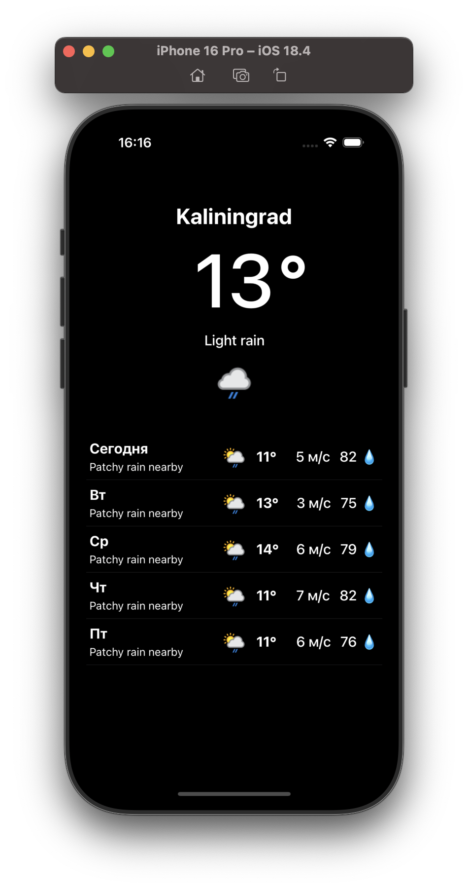
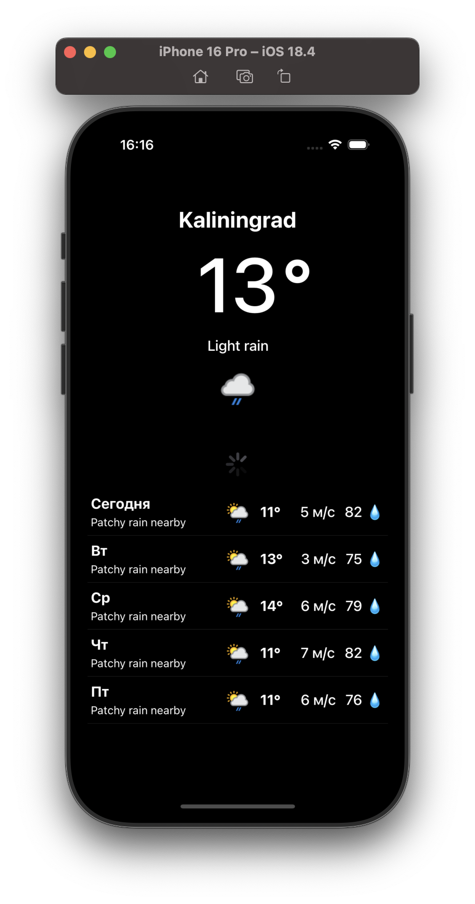
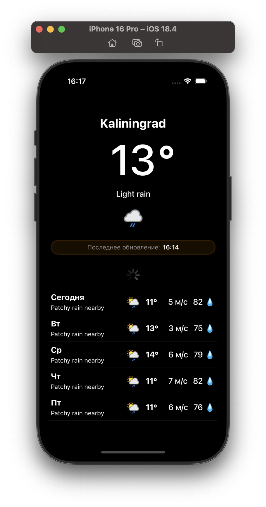
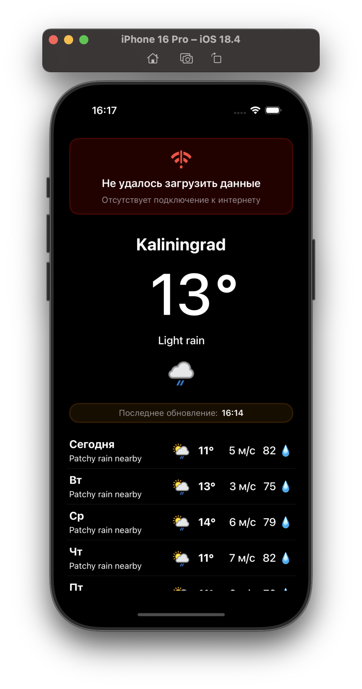

# Weather-forecast

## Описание проекта

Weather forecast — это одноэкранное приложение погоды, использующее бесплатное [WeatherAPI](https://www.weatherapi.com/). Приложение нацелено на демонстрацию архитектуры (чёткого разделения между слоями) и того, насколько код читаемый и легко поддерживаемый. UI в данном проекте не был приоритетом, однако UX внимательно продуман.

Приложение построено на архитектурном паттерне **VIPER**, использует **UIKit**, локальное кеширование данных, а также сетевой слой для получения информации о погоде.

### Основные возможности

- **Просмотр текущей погоды**
- **Прогноз на 5 ближайших дней (включая текущий день)**
- **Автоматическое и ручное обновление данных**

### Технологии

- **Swift** — основной язык разработки
- **UIKit** — построение пользовательского интерфейса
- **VIPER** — модульная архитектура с чётким разделением ответственности
- **Core Data** — локальное хранилище данных
- **URLSession / Custom Networking Layer** — сетевой слой

### Особенности запуска

Для запуска приложения на устройстве или симуляторе необходимо [зарегистрироваться](https://www.weatherapi.com/) и получить бесплатный API-ключ.  
Далее нужно создать файл **Secrets.xcconfig** по пути: Weather-forecast/Config/Secrets.xcconfig 
И добавить в него строку: WEATHER_API_KEY = YOUR_API_KEY

## Заключение

**Weather forecast** — это демонстрация грамотной архитектуры, устойчивой логики и чистой инженерной реализации. Приложение работает надёжно, быстро и удобно в использовании.

## Скриншоты

  
  
